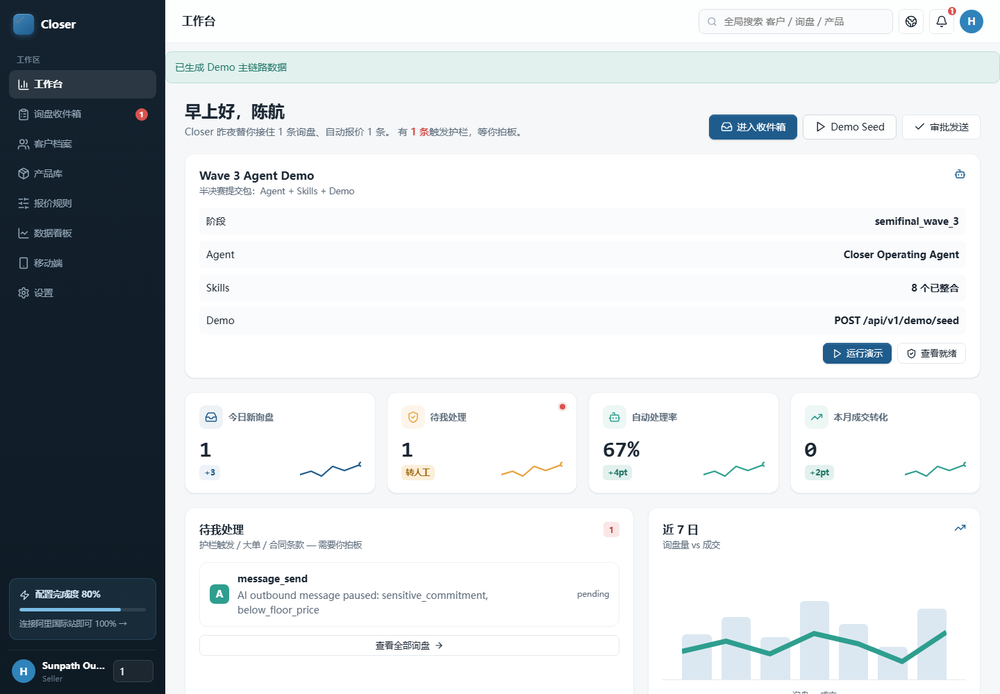
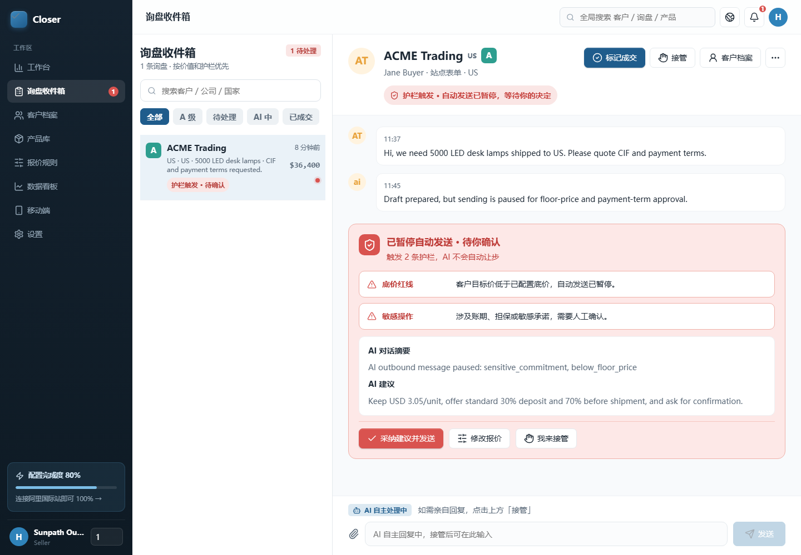
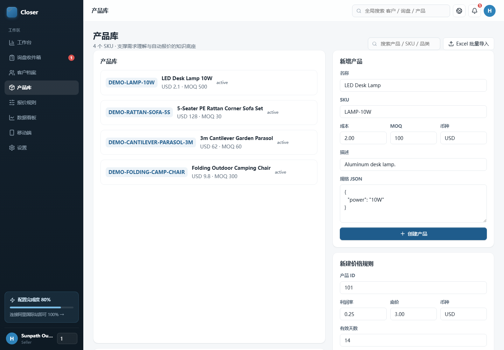

# Closer 工作台

> 跨境 B2B 中小卖家的 AI 询盘成交操作系统

## 在线 Demo

评审可直接打开在线演示：

```text
Ubuntu 全栈 Demo: http://223.167.74.11:8090/
GitHub Pages 在线 Demo: https://cj66666.github.io/chengjiaoguan/
```

说明：如果比赛页或镜像仓库页面仍显示 `.git` 仓库地址，请以上面的在线地址为准。Ubuntu Demo 是真实 FastAPI 后端 + nginx 静态前端，打开后点击 `Demo Seed` 即可体验工作台、询盘收件箱、审批护栏、产品库、报价规则和 readiness。GitHub Pages 版本是只读/静态演示，使用浏览器内置 mock 数据，适合在服务器维护时作为备用入口。

### 在线截图

工作台 Demo Seed 和 Agent/Skills 主链路：



询盘收件箱中的 A 级询盘、评分结果和审批护栏：



产品库、SKU 和价格规则维护入口：



### 脱敏端到端样例

评审可在 Ubuntu Demo 中点击 `Demo Seed` 复现下面这条脱敏链路：

| 步骤 | 脱敏输入/动作 | 系统输出 | 决策边界 |
| --- | --- | --- | --- |
| 原始询盘 | `ACME Trading` 从站点表单提交：`We need 5000 LED desk lamps shipped to US. Please quote CIF and payment terms.` | 创建 customer、inquiry、conversation、message | 规则/API |
| 客户评分 | 公司、企业邮箱、目的国、数量、产品关键词 | A 级，score 100，signals: `real_company`、`verified_domain`、`specific_quantity`、`specific_product`、`destination_known` | 规则优先 |
| 产品匹配 | `LED desk lamps`、`5000`、`US` | 匹配 `LED Desk Lamp 10W`，返回 confidence、matched fields 和备选品 | 规则/检索；低置信度转人工 |
| 报价草稿 | MOQ 500、数量 5000、底价 USD 3.00、阶梯价 USD 3.30 | 生成 USD 16500 报价草稿和有效期 | 确定性报价引擎 |
| 风险审批 | 客户要求 CIF + payment terms，回复涉及敏感承诺；若触碰 `floor_price` 或 `hard_min_price` | 创建 `message_send` approval；硬底价触碰时后端直接阻断 | 人工确认/后端硬护栏 |
| 跟进任务 | 报价生成后 24 小时 | 创建 follow-up，记录 next run time、attempt 和 message | 规则调度 |

规则、LLM 与人工确认的边界：

- **规则完成**：认证、租户隔离、询盘入库、A/B/C 评分、产品匹配 confidence、报价计算、底价/硬底价校验、审批创建、投递记录、跟进调度、readiness/alerts。
- **LLM/provider 可增强**：非结构化询盘理解、多语言表达、Graph decision、知识检索/embedding 和回复润色；本地与线上 Demo 保留 deterministic/rule-based 最小路径。
- **必须人工确认**：低于软底价、触碰敏感承诺、大额合同条款、未匹配产品、PI 生成、需要销售接管的会话。`hard_min_price` 触碰时即使人工审批也不能绕过。

### 最短本地验证

```powershell
python -m pytest
cd frontend
npm run build
```

## 一句话定义

从多渠道询盘进入 -> 客户建档 -> 询盘评分 -> 产品匹配 -> 报价/PI -> 风险审批 -> 投递跟进 -> 复盘运维，AI 陪伴每一步成交判断，让小团队也能像成熟外贸销售组织一样稳定接住高价值询盘。

## 痛点切入

现状：跨境 B2B 中小卖家处理询盘，常常靠销售个人经验和分散工具硬撑。

- 看邮箱、WhatsApp、独立站后台逐条处理 -> 高价值询盘容易被淹没。
- 凭感觉判断买家诚意 -> A 级询盘没有置顶，低价值询盘反而消耗销售时间。
- 翻产品表、历史报价和知识文档 -> 回复慢，报价口径不一致。
- 复制旧报价和旧 PI -> MOQ、阶梯价、汇率、底价、有效期容易出错。
- 让 AI 直接回客户 -> 底价、敏感承诺、大额合同条款存在越权风险。
- 没有投递和跟进闭环 -> 报价发出后谁跟、何时跟、是否失败重试都靠人工记忆。

可被验证的成本假设：

- 一个 A 级询盘晚回复 12-24 小时，成交概率会明显下降。
- 一个报价算错或底价被碰，可能直接吞掉整单毛利。
- 一个大额询盘缺少审批留痕，后续合同和交付风险会放大。
- 小团队每天处理几十条询盘时，真正缺的不是“再来一个 AI 回复”，而是可控、可审计、能复用的成交流程。

## Closer 的三层价值

### 第一层：接住好询盘

用多渠道接入、客户自动建档和询盘评分，把“谁值得优先跟”先判断清楚。

- 站点表单、Email、WhatsApp 询盘进入后自动生成 customer、inquiry、conversation、message。
- 询盘评分识别采购意图、数量、预算、交期、产品匹配和风险信号。
- A/B/C 分级让高价值询盘进入销售优先队列。
- 客户页聚合历史询盘、会话、报价和跟进，避免多渠道上下文断裂。

目标结果：高价值询盘不漏接，销售优先级从“看谁催得急”升级为“看谁更可能成交”。

### 第二层：报准价、守住底线

用产品匹配、知识检索、报价引擎和审批护栏，让报价既快又可控。

- 产品匹配把询盘需求映射到可售产品和知识证据。
- 报价引擎按 MOQ、阶梯价、物流、汇率、底价和有效期生成报价草稿。
- PI 草稿减少重复排版和复制错误。
- 底价、敏感承诺、大额合同、未匹配产品、PI 生成等风险动作必须进入人工审批。

目标结果：报价从人工查表和复制旧文档，变成可解释、可审批、可追踪的业务动作。

### 第三层：让跟进不断档

用投递记录、失败重试、跟进任务和 readiness，让询盘闭环不止停在“已发送”。

- 每次发送都记录 delivery attempt，保留 payload、状态、响应和重试时间。
- 到期跟进、投递重试、邮件轮询和汇率刷新由 workers 统一调度。
- 通知、审批、设置、readiness 和 alerts 让团队知道系统哪里可用、哪里需要接线。
- 历史询盘、报价、审批和投递记录沉淀为下一轮销售判断的上下文。

目标结果：成交流程从“销售个人记忆”升级为“团队可复盘的工作台”。

## 产品形态

一张 Web 工作台，8 个可评审 Skills：

| 顺序 | Skill | 解决的问题 | 核心入口 |
| --- | --- | --- | --- |
| 1 | 多渠道询盘接入 | 把站点表单、Email、WhatsApp 询盘标准化入库 | `POST /api/v1/webhooks/site_form` |
| 2 | 询盘甄别评分 | 判断买家意图、数量、预算、时效和风险信号 | `score_inquiry` |
| 3 | 客户画像与 CRM 建档 | 聚合买家公司、联系人、历史询盘、会话和报价 | `get_customer`、`GET /api/v1/customers/{id}` |
| 4 | 产品匹配与知识检索 | 根据询盘匹配产品并检索知识证据 | `match_product`、`search_knowledge` |
| 5 | 报价与 PI 草稿 | 生成报价草稿、金额、条款和 PI 文档 | `calc_quote`、`generate_pi` |
| 6 | 风险护栏与人工审批 | 拦住底价、敏感承诺、大额合同和未匹配产品 | `send_message`、`request_handoff` |
| 7 | 投递记录、重试与跟进 | 记录发送结果、失败重试和到期跟进 | `create_followup`、`POST /api/v1/workers/run-due` |
| 8 | 原型运维就绪检查 | 展示 LLM、RAG、投递、凭据、汇率、监控等接线状态 | `GET /api/v1/ops/readiness` |

核心特性：

- 多渠道询盘直连和租户隔离。
- AI 询盘评分、客户画像、产品匹配和知识检索。
- 成本、MOQ、阶梯价、汇率、底价和有效期参与报价决策。
- 高风险动作强制审批，Agent 不能绕过服务端护栏。
- 投递记录、失败重试、跟进调度和运维就绪检查。
- React/Vite 工作台可真实操作，不是静态原型。

## 商业价值

| 指标 | 当前常见状态 | Closer 目标 | 收益 |
| --- | --- | --- | --- |
| 首次响应 | 4-24 小时靠人工查看 | 关键询盘分钟级进入队列 | 提高 A 级询盘承接率 |
| 询盘优先级 | 销售凭经验判断 | A/B/C 评分和信号解释 | 销售时间集中到高价值买家 |
| 报价草稿 | 30-60 分钟查表复制 | 3-5 分钟生成草稿 | 更快回复、更少低级错误 |
| 风险控制 | 靠个人记忆守底价 | 高风险动作 100% 审批留痕 | 降低底价和条款越权 |
| 跟进执行 | 报价后手工提醒 | 到期任务、投递记录、失败重试 | 减少报价后断联 |

单店年收益估算可以按真实数据验证：

- 假设小团队每月 100 条有效询盘，年有效询盘 1200 条。
- 如果 AI 评分和快速响应让成交率提升 3 个百分点，相当于每年多成交 36 单。
- 如果每单平均毛利为 ¥2000，则年增量毛利约 ¥7.2 万。
- 若客单价和毛利更高，收益主要来自三部分：少漏 A 级询盘、少报错价格、少断掉跟进。

## 为什么是 Closer

Closer 的含义是“成交者”。我们的定位不是泛化客服机器人，也不是单次报价生成器，而是 **询盘到成交的 AI 工作台**。

它把外贸销售每天最容易断裂的动作收束到一个闭环：

```text
多渠道询盘
  -> 客户建档
  -> 询盘评分
  -> 产品/知识匹配
  -> 报价/PI 草稿
  -> 风险审批
  -> 投递记录
  -> 跟进调度
  -> 运维就绪检查
```

核心差异是：AI 可以理解、判断和生成，但不能绕过业务规则。底价、敏感承诺、大额合同和 PI 等动作必须通过服务端审批护栏。

## Wave 3 半决赛提交定位

- 赛道：跨境 IT 服务赛道。
- 细分方向：供应链询盘。
- 阶段目标：提交可交付最终结果的智能体 Agents，整合 Skills 技能，完成产品演示 Demo。
- 提交主线：Closer Operating Agent -> 8 个业务 Skills -> React 工作台 Demo -> 服务端护栏与可验证证据。

评审入口：

- Online Demo: `https://cj66666.github.io/chengjiaoguan/`
- `docs/WAVE3_SUBMISSION.md`
- `docs/SPECS.md`
- `skills/README.md`
- `GET /api/v1/demo/wave3`
- `scripts/demo_flow.py`
- `frontend/e2e/workbench.spec.js`

## 已实现范围

- FastAPI 后端与 `/api/v1` 公共 API。
- SQLAlchemy ORM 与 PostgreSQL migration，本地测试使用 SQLite 确定性环境。
- PydanticAI runtime 与 Pydantic Graph 八步状态机。
- site form、Email、WhatsApp 入站/出站边界。
- 客户、询盘、会话、消息、报价、审批、通知、跟进、导出、设置、产品和价格规则 API。
- 知识切块、embedding provider、knowledge index/search provider 边界。
- 报价引擎、PI 生成、对象存储边界、汇率缓存刷新/确认。
- React/Vite 工作台与 Playwright 桌面/移动 E2E。

## Wave 3 Agent / Skills / Demo

在线 Demo：

```text
https://cj66666.github.io/chengjiaoguan/
```

说明：GitHub Pages 只能托管静态前端，所以线上 Demo 使用 `VITE_DEMO_MODE=mock` 的浏览器内置数据，确保评审可以直接点击 Demo Seed、收件箱、审批、产品库和设置。完整 FastAPI/PydanticAI 后端仍通过本地启动和测试命令验证。

机器可读提交 manifest：

```powershell
Invoke-RestMethod http://127.0.0.1:8000/api/v1/demo/wave3
```

它会返回：

- Agent：`Closer Operating Agent`、PydanticAI runtime、Pydantic Graph 八步工作流。
- Skills：8 个 `skills/*/SKILL.md` 与对应 API/tool 入口。
- Demo：`POST /api/v1/demo/seed`、前端工作台 URL、命令行演示脚本。
- Verification：后端测试、前端构建和 E2E 命令。

## 演示主链路

1. 创建演示数据：产品、价格规则、知识、A 级询盘、报价、待审批消息和跟进任务。
2. 在工作台查看看板、询盘列表、客户档案和报价详情。
3. 展示报价/消息发送被护栏挂起，必须由人工审批。
4. 批准审批后，后端执行正常投递流程并记录 delivery attempt。
5. 进入设置、产品、渠道、readiness 和 workers 调度入口，展示产品化边界。

## 本地启动

安装后端依赖：

```powershell
python -m pip install -e .[dev]
```

启动后端：

```powershell
python -m uvicorn app.main:app --host 127.0.0.1 --port 8000 --reload
```

启动前端：

```powershell
cd frontend
npm install
npm run dev -- --port 5173
```

常用地址：

- Backend health: `http://127.0.0.1:8000/api/v1/health`
- Frontend workbench: `http://127.0.0.1:5173/`
- Vite proxy check: `http://127.0.0.1:5173/api/v1/dashboard/metrics`

## 验证命令

后端：

```powershell
python -m pytest
```

前端：

```powershell
cd frontend
npm run build
npm run test:e2e
```

2026-06-14 本地验证结果：

- `python -m pytest`: 182 passed，1 warning
- `npm run build`: passed
- `npm run test:e2e`: 2026-06-04 浏览器回归记录为 12 passed

## 生产边界

仓库内已经提供 provider/client/API/脚本/readiness 边界，但真实生产闭环还需要外部系统接线：

- 真实 LLM key/model 与线上工具选择评估。
- 真实托管语义索引和 embedding/search/index provider。
- SMTP、IMAP、WhatsApp Cloud、外部汇率源、对象存储、监控 webhook 和 cron/queue。
- 生产域名下的最终 Demo 彩排和视觉 QA。

详见：

- `docs/COMPETITION_SUBMISSION.md`
- `docs/SPECS.md`
- `docs/WAVE3_SUBMISSION.md`
- `docs/WAVE2_SUBMISSION.md`
- `docs/PUBLIC_REVIEW_CHECKLIST.md`
- `skills/README.md`
- `docs/COMPLETION_AUDIT.md`
- `docs/DEMO_RUNBOOK.md`
- `docs/PRODUCTION_RUNBOOK.md`
- `docs/ENVIRONMENT.md`

## 交叉评测响应入口

针对 Synnovator 上 6 个交叉评测 issue，本仓库已补充三份评审材料：

- `docs/CROSS_REVIEW_ACTION_PLAN.md`：逐条归纳 issue #1-#6，说明本轮已完成修复和仍需外部材料。
- `docs/END_TO_END_EVIDENCE.md`：用一条询盘串起 8 个 Skill/Workflow，区分确定性能力与 LLM/provider 依赖。
- `docs/DATA_OPERATIONS.md`：给出产品 CSV、价格规则 JSON、硬底价 `hard_min_price`、多语言边界、ROI 口径和 30 秒录屏脚本。

本轮代码侧也已回应生产安全建议：

- 渠道凭证缺失、token 过期、通道掉线会进入 `/api/v1/ops/alerts` 和 `/api/v1/ops/readiness`。
- `pricing_rule.logistics_template.hard_min_price` 会作为后端硬底价熔断线，阻断 PI 生成和报价发送。
- `match_product` 对低置信度非标询盘返回 2-3 个备选品和差异提示，不直接给单一匹配结论。
